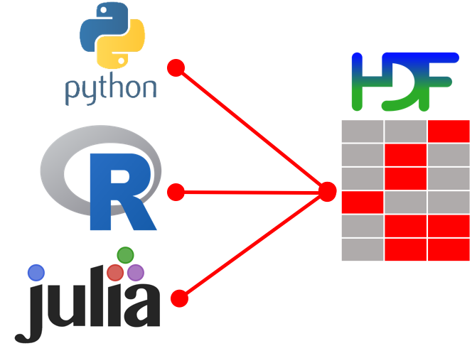

```{r setup, include=FALSE}
library(h5)
library(zoo)
library(magrittr)
library(reshape2)
library(visNetwork)
library(readr)
library(dplyr)
library(plotly)

removeBraces <- function(x) {
  x <- gsub("\\s*\\[[^\\)]+\\]","", x)
  x <- gsub("\\s*\\([^\\)]+\\)","", x)
  x <- gsub("\\s*<[^\\)]+>","", x)
  x
}

splitAndComma <- function(x) {
  strsplit(x, "(,)|(and)", perl = TRUE)
}

removeArtifacts  <- function(x) {
  x <- gsub("(c\\()", "", x, perl = TRUE)
  x <- gsub("\\n", "", x)
  x <- gsub("person", "", x)
  x <- gsub("\"", "", x)
  x <- gsub("\\(", "", x)
  x <- gsub("\\)", "", x)
  x
}

wstrim <- function(x) {
  lapply(x, trimws)
}

#pdb <- tools:::CRAN_package_db()
#saveRDS(pdb, "pdb.rds")
pdb <- readRDS("data/pdb.rds")

if (file.exists('test.h5')) file.remove('test.h5')
```

## Why is it so hard?

- Data Science is an interdisciplinary field.
- Most scientists care more about methods than code.
- Most engineers care more about code than methods.
- Psychological barriers exists for people to collaborate.

## 


## Why is it so important?

- Review of models and code improves overall quality.
- Collaboration can generate new ideas.
- Network effects if more people work efficiently together.

##  Network Effects

<!-- Positive:
- Code is well managed and reusable.
- Team works efficiently together.
- Ideas are generated on a continous basis.
-->

<!-- Negative:
- Spaghetti code
- Teams work against each other
- Ideas are not well discussed, spurious
-->

```{r, echo=FALSE}
f1 <- list(
  family = "Arial, sans-serif",
  size = 18,
  color = "white"
)
flegend <- list(
  color = "white"
)
xaxt <- list(
  title = "Number of Data Scientists",
  ticks='',
  showticklabels=FALSE,
  titlefont = f1
)
yaxt <- list(
  title = "Productivity",
  ticks='',
  showticklabels=FALSE,
  titlefont = f1
)
x <- 1:10
y.pos <- 1:10 * (1.02)^(1:10)
y.neg <- 1:10 * (1.02)^-(1:10)

plot_ly(x = x, y = x, type = 'scatter', mode = 'lines', 
          name = 'Linear Productivity') %>%
  add_lines(x = x, y = y.neg, name = 'Negative Network Effect', 
            fill = 'tonexty', line = list(color = "red")) %>% 
  add_lines(x = c(x, 10), y = c(y.pos, 10), name = 'Positive Network Effect', 
            fill = 'toself', line = list(color = "green")) %>% 
  layout(xaxis = xaxt, yaxis = yaxt, paper_bgcolor = 'rgba(0,0,0,0)', plot_bgcolor='rgba(0,0,0,0)', 
         legend = list(x = 0.1, y = 0.9, font = flegend))
```

## Improving Network Effects

- How can code be managed to have positive network effects?
- How can teams efficiently communicate and collaborate together?

Case study: The CRAN package repository


## CRAN Packages Published

```{r, echo=FALSE, warning=FALSE}
load("data/pkgs.rda")
library(ggplot2)
title <- sprintf("CRAN Packages Published as of %s", format(max(pkgs$Date), "%m/%Y"))

xaxt <- list(
  title = "",
  titlefont = f1,
  tickfont = f1,
  color="white"
)
yaxt <- list(
  title = "Number of Packages Published",
  titlefont = f1,
  tickfont = f1,
  color="white"
)

plot_ly(pkgs, x = ~Date, y = ~published, type = 'scatter', mode = 'lines', 
          name = 'Linear Productivity', fill = 'tonexty') %>%
  layout(xaxis = xaxt, yaxis = yaxt, paper_bgcolor = 'rgba(0,0,0,0)', plot_bgcolor='rgba(0,0,0,0)', 
         legend = list(x = 0.1, y = 0.9, font = flegend))
```


## 

```{r, eval=TRUE, echo=FALSE, warning=FALSE, error=FALSE}
# TODO: Remove packages already shipped with R
imports <- pdb$Imports %>% removeBraces %>% splitAndComma %>% wstrim
depends <- pdb$Depends %>% removeBraces %>% splitAndComma %>% wstrim

impdep <- lapply(1:length(imports), function(x) {
  out <- c(imports[[x]], depends[[x]])
  out <- out[!is.na(out)]
  out <- out[out != "R"]
  out
})
names(impdep) <- pdb$Package

impdep.df <- melt(impdep)
impdep.df$value.idx <- match(impdep.df$value, names(impdep))
impdep.df$L1.idx <- match(impdep.df$L1, names(impdep))
impdep.df <- na.omit(impdep.df)

#pkg_stats <- read_csv("data/2018-09-03.csv", col_types = cols())
#saveRDS(pkg_stats, file = "data/pkg_stats.rds")
#pkg_stats <- read_rds("data/pkg_stats.rds")

toppkg <- read_rds("data/pkg_stats.rds") %>% 
  group_by(package) %>%
  summarise(ndownloads = n())

toppkglist <- toppkg %>% arrange(desc(ndownloads)) %>% 
  select(package) %>% unlist(use.names=FALSE)

nodes.df <- impdep.df %>% filter(L1 %in% head(toppkglist, 300))
reversedep <- impdep.df %>% group_by(value) %>% summarise(dep = n())

nclasses = 9
reversedep$inverval <- cut(log(reversedep$dep), breaks = nclasses)

nodes.df.join <- nodes.df %>% inner_join(reversedep, by = c("L1" = "value"))
hcols <- rev(RColorBrewer::brewer.pal(nclasses, "YlGnBu"))
nodes.df.join$cols <- hcols[as.numeric(nodes.df.join$inverval)]

nodes <- data.frame(id = nodes.df.join$L1.idx,
                    label = nodes.df.join$L1,   
                    color = nodes.df.join$cols
                    )
edges <- data.frame(from = nodes.df.join$L1.idx, to = nodes.df.join$value.idx)
visNetwork::visNetwork(unique(nodes), edges) %>% 
  visInteraction(dragNodes = TRUE, dragView = TRUE, zoomView = TRUE) %>% 
  visNodes(font = list(color = "white")) %>%
  visLayout(improvedLayout = FALSE)
```


## Authors per Package

```{r, echo=FALSE}
authors <- pdb$Author
authors.split <- authors %>% removeArtifacts %>% removeBraces %>% splitAndComma %>% wstrim
pdb$NumAuthors <- sapply(authors.split, length)
pdb$NumAuthors <- factor(ifelse(pdb$NumAuthors <= 10, pdb$NumAuthors, "More"), levels = c(1:10, "More"))

xaxt <- list(
  title = "",
  titlefont = f1,
  tickfont = f1,
  color="white"
  #type="log"
)
yaxt <- list(
  title = "Number of Packages Published",
  titlefont = f1,
  tickfont = f1,
  color="white"
)

plot_ly(x = pdb$NumAuthors, type = "histogram") %>%
 layout(xaxis = xaxt, yaxis = yaxt, paper_bgcolor = 'rgba(0,0,0,0)', plot_bgcolor='rgba(0,0,0,0)', 
         legend = list(x = 0.1, y = 0.9, font = flegend))

#p <- ggplot(pdb, aes(x = NumAuthors)) + geom_histogram(bins = 10) + scale_x_log10() + theme_minimal() + 
```

## Package Redundancy

- Lack of communication between authors can lead to redundant packages.
- Redundancy not helpful for infrastructure packages.
- Example: R-Excel Package
- Example: HDF5 package development

## 

```{r, eval=TRUE, echo=FALSE, warning=FALSE, error=FALSE}
networkfun <- function(pkg) {
  filter.excel <- (impdep.df$L1 %in% pkg) | (impdep.df$value %in% pkg)
  nodes.df.excel <- impdep.df[filter.excel, ]
  nodes.df.excel$cols <- ifelse(nodes.df.excel$L1 %in% pkg, "red", "green")
  
  nodes <- data.frame(id = nodes.df.excel$L1.idx,
                      label = nodes.df.excel$L1,   
                      color = nodes.df.excel$cols)
  edges <- data.frame(from = nodes.df.excel$L1.idx, to = nodes.df.excel$value.idx)
  visNetwork::visNetwork(unique(nodes), edges) %>% 
    visInteraction(dragNodes = TRUE, dragView = TRUE, zoomView = TRUE) %>% 
    visNodes(font = list(color = "white")) %>%
    visLayout(improvedLayout = FALSE)
}

excelpkg <- c('readxl', 'xlsx', 'openxlsx', 'XLConnect', 'gdata')
networkfun(excelpkg)
```

## HDF5 packages

- Store large amounts of data, e.g. tick data
- Unsatisfied with rhdf5, hdf5, h5r, ... &rarr; h5

{height=100%}

<!--  -->

[^1]: Developed by NCSA[^1] and the tri-labs, supported by NASA[^2]

##

> 2 years ago ...

- Presentation of **h5** at R/Finance 2016
- **Rcpp** to interface HDF5 C++ API
- Basic HDF5 features implemented 

## ... 2 months later ...

On June 21, 2016 Holger wrote:

> ... my name is Holger Hoefling, I have developed a new version of a wrapper library for hdf5 (R6 Classes, almost all function calls wrapped, full support for all datatypes including tables etc) ...

## And I replied:

On June 21, 2016 Mario wrote:

> sounds interesting!

<!-- > - is it already open source/on github? would like to take a look... -->
<!-- > - are you planning to release it on cran? -->
<!-- > - are you building against the c++ api? -->

## What's different in hdf5r?

- Automatic code generation against HDF5 C API
- Usage of **R6** (instead of **S4**) classes
- Close connections during garbage collection
- Broad coverage of low-level library features 


## Merging codebases

- Maintain high-level interface and test cases from **h5**
- Get low-level HDF5 support within R

{width=200px}

##

On Oct 10, 2016 Holger wrote:

> thanks - merged!

## The Joys Collaboration

(after overcoming psychological barriers)

- Code reviews
- Higher Quality Code
- End product of higher qualtity than separate packages.

## 

> Q: How can code be managed to have positive network effects?

- Put it into re-usable package.
- Continous code-reviews and tests.
- Transparent platform to inspect.

## 

> Q: How can teams efficiently communicate and collaborate together?

- Have the right tools and mindset in place.
- Incentivise collaborative efforts.
- Accept unexpected hypotheses and failures
- Open mindedness.

## Collaboration Torvalds Style

Tools used: E-mail, Git


https://www.youtube.com/watch?v=LE0JtUeyVJA


## {data-background-iframe="https://github.com/r-lib"}

## {data-background-iframe="https://www.quantargo.com"}

## Thank you!

<!-- TODO: Insert font-awesome icons for homepage, coffee?? -->

Check out our homepage at 

https://www.quantargo.com

Presentation source available at 

https://github.com/Quantargo/data-science-collaboration

